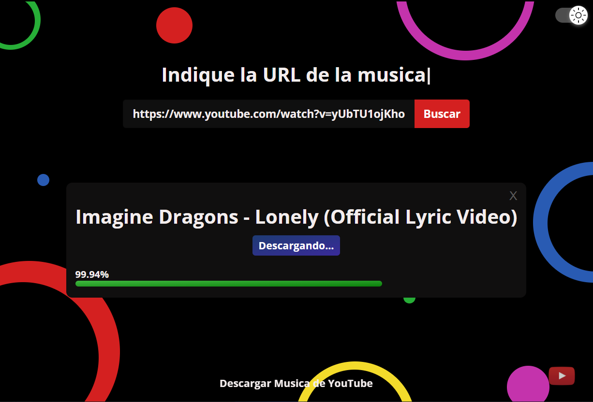

> # ㅤㅤㅤㅤㅤㅤDownload Music

`Una aplicacion de escritorio creada con ElectronJS v22.1.0 y ytdl-core para las ddescargas`

```
 - Las descargas se guardaran en la carpeta "Descargas" o "Downloads"

 - Notifica caundo inicie y acabe la descarga
```

```js

 npm i /*para instalar dependencias */

 npm start /* iniciar modo desarrollo */

 npm dun dist /* crea una carpeta llamada "build" donde esta el ejecutable junto al instalador :D */


```

> ## - Solo necesita la URL (de youtube) para buscar la musica


> ## Despues de buscar la musica puedes descargarla

- se mostrara una barra de progreso
- se lanzara una notificacion cuando la descarga inicie al igual cuando finalice



> ## [link de descarga del instalador](https://www.mediafire.com/file/9vn65nrovee79eb/Download+Music+Setup+1.0.0.exe/file)
